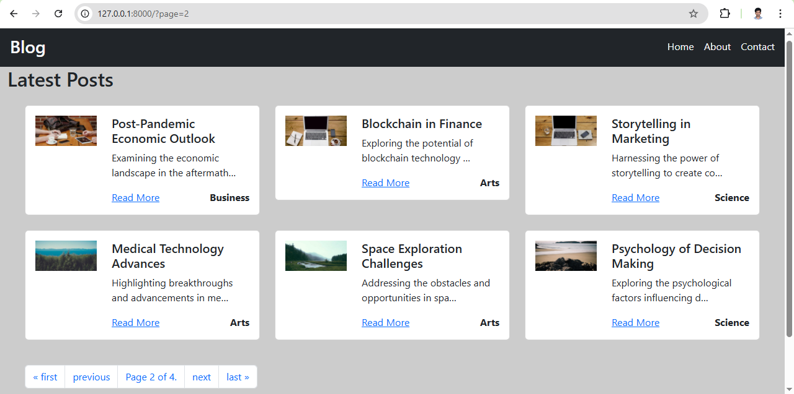
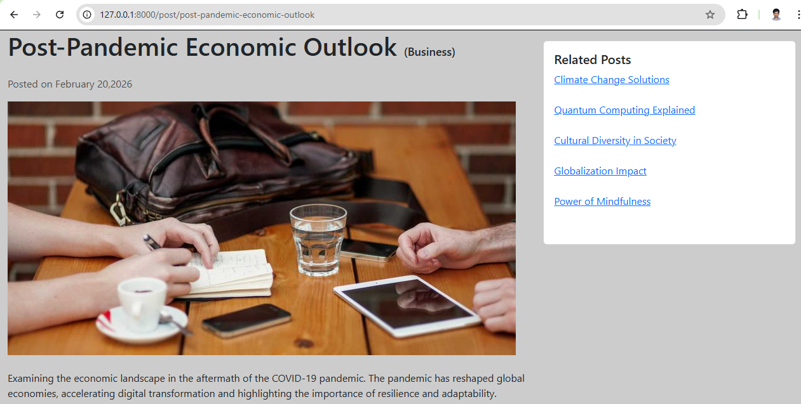
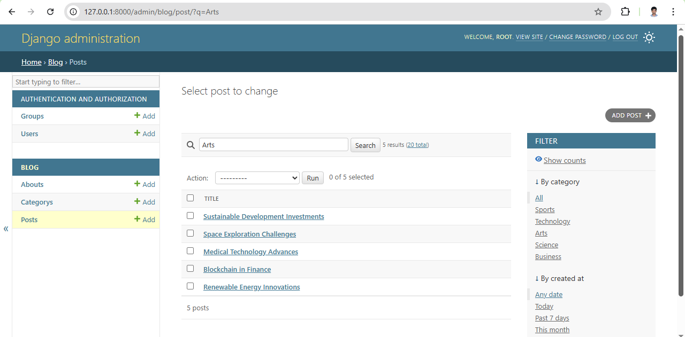

# 📝 Django Blog Application


A scalable and modular **Blog Web Application** built using Django and MySQL.  
Implements structured database relationships, optimized queries, slug-based routing, pagination, and a customized Django Admin panel.

---

## 🚀 Key Features

- Full CRUD operations for blog posts  
- Category-based organization using ForeignKey relationships  
- Search functionality using `icontains`  
- Pagination for efficient content loading  
- SEO-friendly slug-based URLs  
- Related posts logic  
- Customized Django Admin panel  
- MySQL database integration  
- Responsive UI with Bootstrap  

---

## 📸 Screenshots

### 🏠 Blog Home Page


---

### 📄 Single Post View


---

### 🛠 Customized Admin Panel


---

## 🛠 Tech Stack

**Backend:** Python, Django  
**Database:** MySQL  
**Frontend:** HTML5, CSS3, Bootstrap  
**Tools:** Git, GitHub, VS Code  

---

## 📂 Project Structure

```
Blog_App/
│
├── blog/
│   ├── management/
│   ├── migrations/
│   ├── templates/
│   ├── static/
│   ├── admin.py
│   ├── models.py
│   ├── views.py
│   ├── urls.py
│   ├── forms.py
│   └── apps.py
│
├── screenshots/
│   ├── home.png
│   ├── single_post.png
│   └── admin.png
│
├── templates/
├── manage.py
├── requirements.txt
└── .gitignore
```

---

## ⚙️ Setup Instructions

### 1️⃣ Clone Repository

```bash
git clone https://github.com/royhamlinjr/Blog_App.git
cd Blog_App
```

### 2️⃣ Create Virtual Environment

```bash
python -m venv env
```

Activate:

**Windows**
```bash
env\Scripts\activate
```

**Mac/Linux**
```bash
source env/bin/activate
```

### 3️⃣ Install Dependencies

```bash
pip install -r requirements.txt
```

### 4️⃣ Configure MySQL in `settings.py`

```python
DATABASES = {
    'default': {
        'ENGINE': 'django.db.backends.mysql',
        'NAME': 'your_database_name',
        'USER': 'your_mysql_username',
        'PASSWORD': 'your_mysql_password',
        'HOST': 'localhost',
        'PORT': '3306',
    }
}
```

### 5️⃣ Apply Migrations

```bash
python manage.py makemigrations
python manage.py migrate
```

### 6️⃣ Create Superuser

```bash
python manage.py createsuperuser
```

### 7️⃣ Run Server

```bash
python manage.py runserver
```

Access:
- Application → http://127.0.0.1:8000/
- Admin Panel → http://127.0.0.1:8000/admin/

---

## 🧠 Concepts Demonstrated

- Django ORM & Model Relationships  
- ForeignKey and Query Optimization  
- Slug generation for dynamic routing  
- Admin panel customization  
- Pagination and search implementation  
- Template inheritance  
- Static file management  
- MySQL configuration  

---

## 🚀 Future Enhancements

- User authentication & authorization  
- Comment system  
- Image upload functionality  
- REST API implementation  
- Deployment (Render / AWS)  

---

## 👤 Author

**Roy Hamlin**  
LinkedIn: https://linkedin.com/in/royhamlin  
Email: royhamlinjr7@gmail.com
