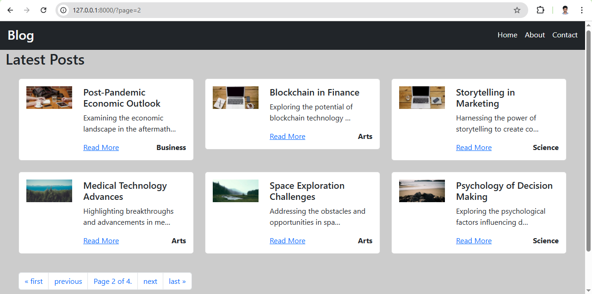
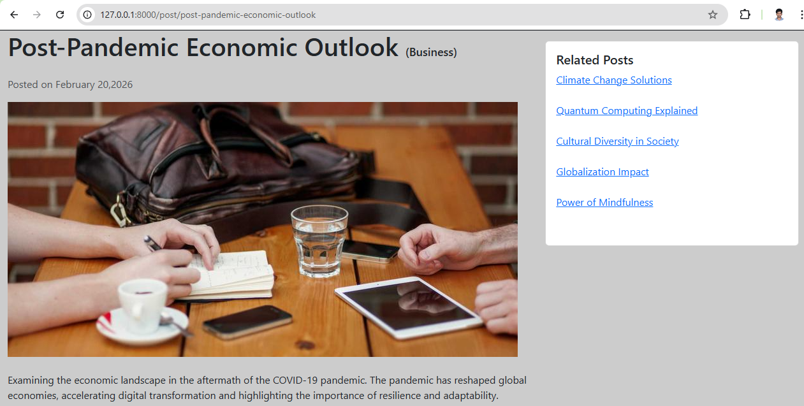
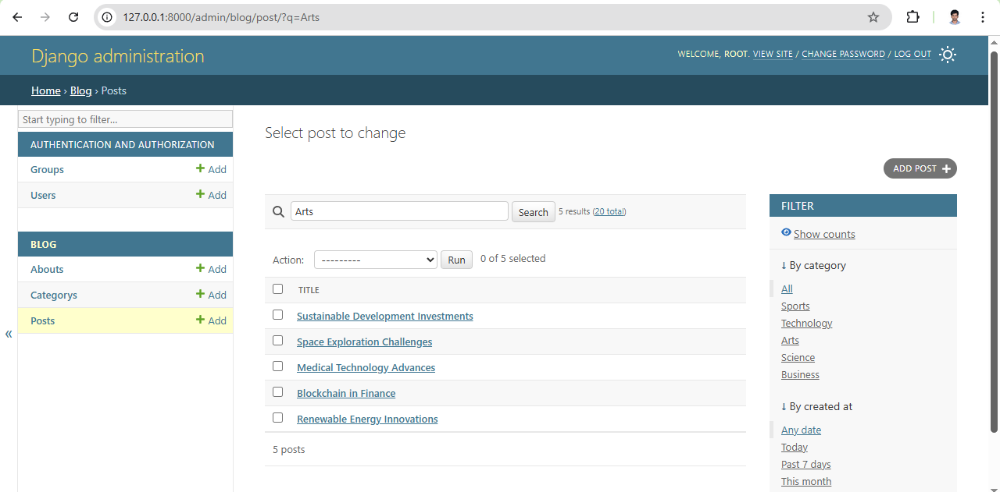

# 📝 Django Blog Application

<div align="center">


</div>

<br/>

> A scalable and modular **Blog Web Application** built with **Django** and **MySQL**.
> Implements structured database relationships, slug-based routing, pagination, search, and a fully customized Django Admin panel.

---

## 🚀 Key Features

| Feature | Description |
|---|---|
| ✍️ **Full CRUD** | Create, read, update, and delete blog posts |
| 🗂️ **Category System** | Category-based post organization using ForeignKey |
| 🔍 **Search** | Full-text search using Django ORM `icontains` |
| 📃 **Pagination** | Efficient content loading with Django pagination |
| 🔗 **Slug URLs** | SEO-friendly slug-based dynamic routing |
| 🔁 **Related Posts** | Displays related posts based on category |
| 🛠️ **Admin Panel** | Fully customized Django Admin for content management |
| 🗄️ **MySQL** | Relational database with optimized queries |
| 📱 **Responsive UI** | Mobile-friendly design with Bootstrap |

---

## 📸 Screenshots

<details>
<summary>Click to view screenshots</summary>

### 🏠 Blog Home Page


### 📄 Single Post View


### 🛠 Customized Admin Panel


</details>

---

## 🛠 Tech Stack

| Layer | Technology |
|---|---|
| **Backend** | Python 3.13.7, Django |
| **Frontend** | HTML5, CSS3, Bootstrap |
| **Database** | MySQL |
| **Version Control** | Git & GitHub |

---

## 📂 Project Structure
```
Blog_App/
├── blog/           # Core Django app
├── templates/      # HTML templates
├── screenshots/    # Project screenshots
├── manage.py
├── requirements.txt
└── .gitignore
```

---

## ⚙️ Setup Instructions

> **Prerequisites:** Python 3.13.7, pip, MySQL installed and running

### 1️⃣ Clone Repository
```bash
git clone https://github.com/royhamlinjr/Blog_App.git
cd Blog_App
```

### 2️⃣ Create & Activate Virtual Environment
```bash
python -m venv env
```
```bash
# Windows
env\Scripts\activate

# Mac/Linux
source env/bin/activate
```

### 3️⃣ Install Dependencies
```bash
pip install -r requirements.txt
```

### 4️⃣ Configure MySQL

Update the `DATABASES` section in `settings.py` with your MySQL credentials.

### 5️⃣ Apply Migrations
```bash
python manage.py makemigrations
python manage.py migrate
```

### 6️⃣ Create Superuser
```bash
python manage.py createsuperuser
```

### 7️⃣ Run Server
```bash
python manage.py runserver
```

✅ Application → **http://127.0.0.1:8000/**
✅ Admin Panel → **http://127.0.0.1:8000/admin/**

---

## 🧠 Concepts Demonstrated

**Backend**
- Django ORM & Model Relationships (`ForeignKey`)
- Slug Generation for Dynamic Routing
- Query Optimization with `icontains`
- Admin Panel Customization
- Pagination & Search Implementation

**Frontend**
- Django Template Inheritance
- Static File Management
- Responsive UI with Bootstrap

**General**
- MySQL Configuration & Integration
- Git Version Control Best Practices

---

## 🔮 Future Enhancements

- [ ] 🔐 **User Authentication** — Register, login, and author-based post management
- [ ] 💬 **Comment System** — Allow readers to comment on posts
- [ ] 🖼️ **Image Uploads** — Featured images for blog posts
- [ ] 🔗 **REST API** — Expose blog data via Django REST Framework
- [ ] 🚀 **Deployment** — Host on Render or AWS

---

## 🤝 Contributing

Contributions, issues, and feature requests are welcome!

1. Fork the repository
2. Create your feature branch — `git checkout -b feature/YourFeature`
3. Commit your changes — `git commit -m "Add YourFeature"`
4. Push to the branch — `git push origin feature/YourFeature`
5. Open a Pull Request

---

## 📄 License

This project is licensed under the **MIT License** — feel free to use and modify it.

---

## 👤 Author

<div align="center">

**Roy Hamlin**

[](mailto:royhamlinjr7@gmail.com)
[](https://linkedin.com/in/royhamlin)

</div>

---

<div align="center">

⭐ **If you found this project helpful, please consider giving it a star!** ⭐

*Made with ❤️ by Roy Hamlin*

</div>
